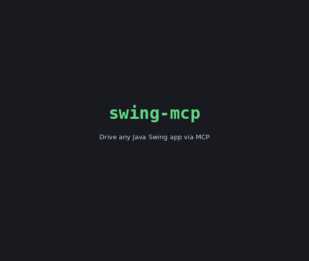

# swing-mcp

<!-- mcp-name: io.github.TinusJ/swing-mcp -->

An MCP (Model Context Protocol) server for interacting with Java Swing applications — inspired by [chrome-devtools-mcp](https://github.com/ChromeDevTools/chrome-devtools-mcp), but targeting any Swing UI instead of HTML pages.



## Modules

- `swing-mcp-server` — Spring Boot MCP server (stdio transport) exposing Swing automation tools.
- `swing-mcp-agent` — Java agent loaded into the target Swing JVM (at launch via `-javaagent`, or dynamically by PID). Runs a localhost-only JSON line-protocol socket server that executes commands on the Swing EDT.
- `swing-mcp-common` — Shared command/DTO types between server and agent.
- `swing-mcp-demo` — Demo Swing application used for integration testing.

## How it works

```
MCP client (stdio) ──▶ swing-mcp-server ──localhost socket──▶ swing-mcp-agent (inside target JVM) ──▶ Swing EDT
```

1. The MCP client calls `launch_app` (starts a JVM with the agent preloaded) or `attach_to_app` (loads the agent into a running JVM by PID).
2. The agent binds a loopback-only port in `swing.mcp.agent-port-min..max` and reports it back through a response file.
3. Tools such as `take_snapshot`, `click`, and `fill` are forwarded as JSON line commands and executed on the Event Dispatch Thread.

See [docs/tools](docs/tools/README.md) for the full tool documentation (per-category pages), or [docs/tool-reference.md](docs/tool-reference.md) for the single-page quick reference.

## Skills

The [skills](skills/README.md) directory contains agent skills (`SKILL.md` files) that teach AI coding agents how to use Swing MCP effectively — core workflows, UI testing patterns, and troubleshooting.

## Building

Requires JDK 21+ and Maven.

```bash
mvn verify
```

GUI integration tests are skipped in headless environments; CI runs them under `xvfb`.

## Running

Build everything, then register the server with your MCP client (see
[docs/installation.md](docs/installation.md) for per-client instructions —
IntelliJ IDEA, VS Code, Claude Desktop, Claude Code, Cursor, Windsurf):

```json
{
  "mcpServers": {
    "swing": {
      "command": "java",
      "args": ["-jar", "/path/to/swing-mcp-server-1.0.0.jar"],
      "env": {
        "SWING_MCP_AGENT_JAR": "/path/to/swing-mcp-agent-1.0.0.jar"
      }
    }
  }
}
```

Try it against the demo app:

1. `launch_app` with `java -jar swing-mcp-demo/target/swing-mcp-demo-1.0.0.jar`
2. `take_snapshot` to discover component UIDs
3. `click`, `fill`, `select_option`, … to interact

## MCP Registry

This server is published to the [MCP Registry](https://registry.modelcontextprotocol.io) as
`io.github.TinusJ/swing-mcp`, distributed as an MCPB bundle attached to GitHub releases.
See [docs/registry-publishing.md](docs/registry-publishing.md) for how publishing works.

## Security notes

- The agent listens on the loopback interface only.
- `evaluate_java` (arbitrary code execution in the target JVM) is disabled by default; enable with `swing.mcp.evaluate.enabled=true`.
